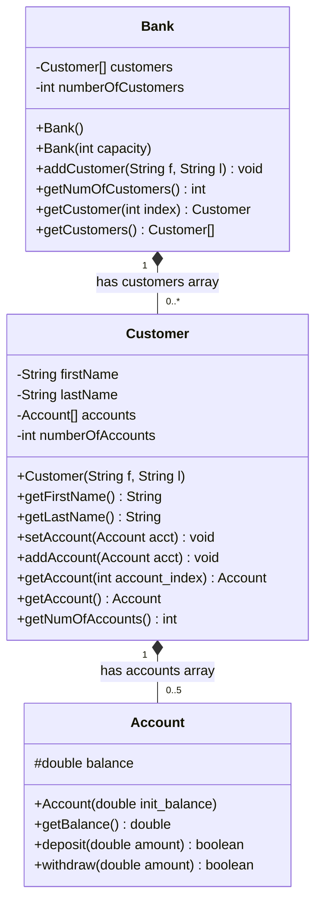

Self Exercise/Exploration of Array and ArrayList

---

## 📌 Submission Format (Format Balasan Diskusi)

Copy and fill this format when submitting your assignment to the Berajah LMS forum:

```text
NIM                    : [Isi NIM Anda di sini / ضع رقمك الجامعي هنا]
Name                   : [Isi Nama Lengkap Anda / ضع اسمك الكامل هنا]
GitHub Repository Link : [https://github.com/username/repository-name]
```

---

## 📖 Project Overview (نظرة عامة على المشروع)

This repository contains the complete implementation and exploration of **Arrays** and **ArrayLists** in Java, based on slides 26 through 31 of the PBO 4 lecture material. 

The project includes:
1. **`Account.java`**: Implements bank account logic (deposit, withdraw, balance inquiry) with strict condition checking (Slide 27, 28).
2. **`Customer.java`**: Implements customer data containing an array of accounts (`Account[]`) with a fixed maximum size of 5 (Slide 27, 29).
3. **`Bank.java`**: Manages a bank that holds an array of customers (`Customer[]`) with dynamic index tracking and safety bounds checking (Slide 30, 31).
4. **`BankDemo.java`**: The main driver program featuring:
   - An interactive console **ATM / Banking Menu** using `java.util.Scanner` to test all banking operations interactively.
   - An automated **Array vs. ArrayList exploration test** showcasing all core operations (`add`, `get`, `set`, `remove`, `size`, `Arrays.sort()`).
5. **`BnakDemo.java`**: A convenience alias resolving the typo from the original starter file.

All Java source files are written in English standard naming conventions with **comprehensive Arabic comments** explaining every class, attribute, constructor, and method in detail (`تعليقات عربية مفصلة`).

---

## 🏛️ UML Architecture & Class Diagrams



---

## ⚖️ Key Concepts: Array vs. ArrayList (Slide 23)

| Aspect | Fixed Array (`Type[]`) | Dynamic List (`ArrayList<T>`) |
| :--- | :--- | :--- |
| **Size** | Fixed at creation (`new int[5]`) | Dynamic (grows and shrinks automatically) |
| **Data Types** | Primitives (`int`, `double`) OR Objects | Objects only (uses Wrapper classes: `Integer`, `Double`) |
| **Element Access** | `a[i]` (Fast, direct memory index) | `list.get(i)` / `list.set(i, value)` |
| **Size Query** | `a.length` (**field**, without parentheses) | `list.size()` (**method**, with parentheses) |
| **Add / Remove** | Manual copy / re-allocation | Built-in: `add()`, `add(index, val)`, `remove(index)` |
| **Utility Methods** | `java.util.Arrays` (`sort`, `copyOf`, `toString`) | Built-in collection methods & `Collections` |
| **Best Used When** | Fixed/known size, primitive types | Variable/unknown size, object collections |

---

## 💻 Requirements & Dependencies

- **JDK Version:** Java SE 8 or newer (tested on Java 26 / OpenJDK).
- **Libraries:** No external third-party dependencies required. Standard Java SE Library used (`java.util.Scanner`, `java.util.Arrays`, `java.util.ArrayList`, `java.util.Locale`).

---

## 🚀 How to Compile and Run (طريقة البناء والتشغيل)

### 1. Compile the Source Code
Open your terminal / command prompt inside the `bank/` folder:
```bash
cd bank
javac *.java
```

### 2. Run Interactive ATM Menu (القائمة التفاعلية)
```bash
java BankDemo
```

### 3. Run Automated Exploration Mode (التشغيل التلقائي للاختبارات)
```bash
java BankDemo --test
```
*(or via alias)*:
```bash
java BnakDemo --test
```

---

## 📸 Sample Execution Output (مخرجات البرنامج)

### 1. Automated Exploration Mode (`--test`)
```text
=======================================================
   AUTOMATED EXPLORATION: ARRAY & ARRAYLIST (PBO 4)   
=======================================================

--- [PART 1: Bank & Customer Objects Array (Slides 26-31)] ---
Initial Customer Count (bank.getNumOfCustomers()): 3
  Index 0: Jane Simms
  Index 1: Owen Bryant
  Index 2: Tim Soleh

Testing Account operations for Jane:
  Initial Balance: $500.00
  After deposit $150.00: $650.00
  Withdraw $200.00 [Result: true] -> Balance: $450.00
  Withdraw $1000.00 [Result: false] -> Balance: $450.00

--- [PART 2: java.util.Arrays Utility Methods (Slide 11)] ---
Original array: [5, 2, 8, 1, 9]
After Arrays.sort(): [1, 2, 5, 8, 9]
After Arrays.copyOf(numbers, 7): [1, 2, 5, 8, 9, 0, 0]

--- [PART 3: Dynamic ArrayList Exploration (Slides 16-25)] ---
ArrayList after additions: [Emily, Bob, Cindy]
ArrayList size(): 3
After inserting 'Ann' at index 1: [Emily, Ann, Bob, Cindy]
After replacing element at index 3 with 'Carolyn': [Emily, Ann, Bob, Carolyn]
After removing element at index 0: [Ann, Bob, Carolyn]
First element (get(0)): Ann
Last element (get(size() - 1)): Carolyn

--- [PART 4: Array vs ArrayList Summary (Slide 23)] ---
+----------------------+-------------------------+-------------------------+
| Aspect               | Array int[] / Object[]  | ArrayList<T>            |
+----------------------+-------------------------+-------------------------+
| Size                 | Fixed at creation       | Grows / shrinks dynamic |
| Holds                | Primitives OR Objects   | Objects only (Wrappers) |
| Access               | a[i]                    | get(i) / set(i, x)      |
| Size Query           | a.length (field)        | size() (method)         |
| Add / Remove         | Manual resize/copy      | add(), remove() builtin |
| Best when            | Fixed size, primitives  | Dynamic size, objects   |
+----------------------+-------------------------+-------------------------+
```

### 2. Interactive ATM Menu Mode
```text
=================================================
   BANK & ARRAY/ARRAYLIST EXPLORATION SYSTEM     
       PBO 4 - Universitas Mataram (UNRAM)       
=================================================

------------- [ ATM / BANK MENU ] -------------
 1. Display All Customers & Accounts
 2. Add New Customer
 3. Add Bank Account to Customer
 4. Deposit Money
 5. Withdraw Money
 6. Check Customer Account Balance
 7. Run Array vs ArrayList Exploration (Slides 11, 23, 26-31)
 8. Exit
-------------------------------------------------
Select an option [1-8]: 1

====== Bank Customers List (Total: 4) ======
Customer [1]: Jane Simms
   Number of Accounts: 2
   - Account [1]: Balance = $500.00
   - Account [2]: Balance = $150.00
Customer [2]: Owen Bryant
   Number of Accounts: 1
   - Account [1]: Balance = $200.00
Customer [3]: Tim Soleh
   Number of Accounts: 1
   - Account [1]: Balance = $1500.50
Customer [4]: Maria Anders
   Number of Accounts: 1
   - Account [1]: Balance = $350.75
```

---

## 📂 Project Structure (هيكل المشروع)

```text
pbo/
├── Eng_PBO_4_ArrayAndArrayList.pdf   # Lecture material slides
├── README.md                          # Root GitHub repository documentation
└── bank/
    ├── Account.java                   # Bank account class (balance, deposit, withdraw)
    ├── Customer.java                  # Customer class managing Account[] array
    ├── Bank.java                      # Bank class managing Customer[] array
    ├── BankDemo.java                  # Main driver with ATM menu & Array/ArrayList exploration
    ├── BnakDemo.java                  # Alias wrapper for BankDemo
    └── README.md                      # Bank folder documentation
```

---

## 📝 شرح تفاصيل الكود باللغة العربية (Code Details in Arabic)

1. **فئة الحساب (`Account.java`)**:
   - تحتوي على المتغير المحمي `balance` لحفظ الرصيد.
   - توفر دالة `deposit(amount)` تقبل المبالغ الموجبة فقط وتضيفها للرصيد مع إرجاع `true` أو `false`.
   - توفر دالة `withdraw(amount)` التي تتحقق من وجود رصيد كافٍ قبل خصم المبلغ وتمنع السحب بالسالب.

2. **فئة العميل (`Customer.java`)**:
   - تحتوي على الاسم الأول `firstName` واسم العائلة `lastName`.
   - تحتوي على مصفوفة ثابتة الحجم من الحسابات `Account[] accounts = new Account[5]` بناءً على السلايد رقم 29.
   - توفر دوال الإضافة `setAccount` مع حماية من تجاوز سعة المصفوفة لتفادي `ArrayIndexOutOfBoundsException`.
   - توفر دوال استرجاع الحساب برقم الفهرس `getAccount(index)` بالإضافة للحساب الافتراضي `getAccount()`.

3. **فئة البنك (`Bank.java`)**:
   - تدير مصفوفة العملاء `Customer[] customers` بعداد `numberOfCustomers`.
   - السعة الافتراضية محددة بـ 10 عملاء (أكبر من 5 حسب الشرائح).
   - دالة `addCustomer` تنشئ كائن العميل مباشرة وتضيفه للمصفوفة وتزيد العداد تلقائياً.

4. **فئة التجربة (`BankDemo.java`)**:
   - تقدم محاكاة صراف آلي / بنك تفاعلي عبر وحدة التحكم (Console) باستخدام `Scanner`.
   - تستعرض الفروق الجوهرية بين المصفوفات العادية و `ArrayList` مستشهدة بالسلايدات من 11 إلى 31.
